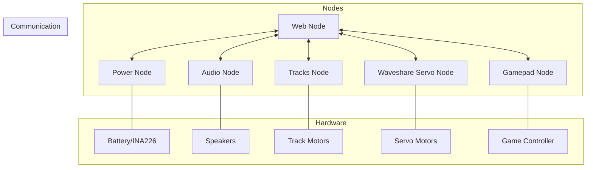
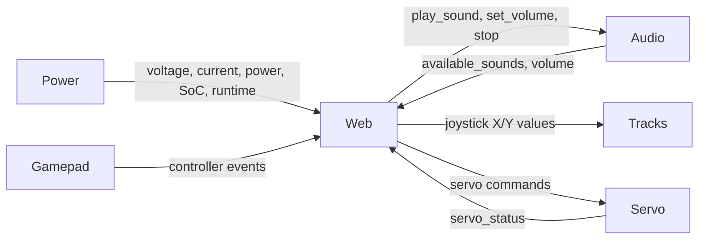

# WALL-E-DORA

wall-e-dora is a multi-node robotics control system based on the Dora framework, designed to power a Wall-E inspired robot with comprehensive movement, audio, and interaction capabilities.

## System Architecture

The project follows a distributed, modular architecture with specialized nodes that communicate through the Dora framework:



### Active Nodes
- **Power Node**: Monitors system power metrics including voltage, current, power consumption, state of charge (SoC), and runtime. Can trigger system shutdown at low battery levels.
- **Web Node**: Provides a web interface for system monitoring and control. Displays power metrics and audio controls. Acts as the central hub for all node communication.
- **Audio Node**: Manages audio playback with volume control and sound file management. Handles Wall-E's voice clips and sound effects.
- **Waveshare Servo Node**: Controls servo motors for animatronic movements, supporting calibration, position control, and safety features.

### Development Nodes
- **Gamepad Node**: (In Development) Interfaces with gamepad devices for input control.
- **Tracks Node**: (In Development) Firmware and control system for track motor management.

## Node Communication Flow

Nodes exchange data through the Dora framework using the following pattern:



## Core Technologies

- **Dora Framework**: Used for inter-node communication and message passing
- **Apache Arrow**: For efficient data serialization between nodes
- **Python 3.12+**: Primary programming language for node implementation
- **React & BeerCSS**: Frontend technologies for the web interface
- **Pygame**: Audio playback engine
- **Raspberry Pi Pico (RP2040)**: Microcontroller for track motor control
- **Waveshare Servo Controller**: For animatronic servo control

## Building and Development

### Prerequisites
- Python 3.12+
- Dora framework
- Node.js and pnpm (for web development)
- Additional dependencies listed in each node's pyproject.toml

### Setup
1. Create a virtual environment: `python -m venv .venv`
2. Activate the environment: `source .venv/bin/activate`
3. Install dependencies: `uv pip install -e .`

### Building and Running

Use the provided Makefile targets:
```bash
# Run all nodes using uv for dependency management
make run

# Build web resources (runs in background to rebuild on changes)
make web/build-watch

# Build tracks firmware
make tracks/build

# Flash tracks firmware (requires device path in Makefile)
make tracks/flash

# Build and flash tracks firmware
make tracks/update
```

## Development and Testing

- Code formatting: Use `ruff` for consistent code style
- Testing: Run tests with `pytest`
- Node development: Follow the node structure in `nodes/` directory

## Configuration

Node dataflow is defined in `dataflow.yml`. Current configuration includes:
- Power monitoring (10-second intervals)
- Web interface updates (100ms intervals)
- Audio system with volume control
- Extensible node configuration

## Node Documentation

Each node has detailed requirements and documentation in its respective README:

- [Web Node](nodes/web/README.md) - Web interface and control hub
- [Audio Node](nodes/audio/README.md) - Sound playback and management
- [Power Node](nodes/power/README.md) - Battery monitoring
- [Tracks Node](nodes/tracks/README.md) - Motor movement control
- [Waveshare Servo Node](nodes/waveshare_servo/README.md) - Servo animation control
- [Gamepad Node](nodes/gamepad/README.md) - Controller input handling

## System Integration Requirements

### Node Communication
- Ensure reliable data flow between all nodes
- Handle node failures gracefully
- Support dynamic node discovery
- Maintain synchronized state across the system
- Provide error reporting and recovery

### System Initialization
- Implement proper startup sequence
- Establish node dependencies and startup order
- Ensure graceful initialization with hardware errors
- Support partial system functionality if some nodes fail
- Provide status feedback during startup

### Performance
- Minimize latency for control commands
- Optimize CPU and memory usage
- Ensure reliable operation on resource-constrained hardware
- Support system monitoring and diagnostics
- Implement appropriate error handling throughout the system

## Future Enhancements

1. Distributed operation across multiple devices
2. Cloud connectivity for remote monitoring
3. Advanced diagnostics and self-healing
4. Over-the-air updates for all components
5. Configuration management system
6. Camera integration for computer vision

## Contributing

Follow the guidelines in `CLAUDE.md` for coding style and best practices. Contributions should adhere to the established patterns for each node type. All code is released under the MIT License.

_Last updated: March 21, 2025_
