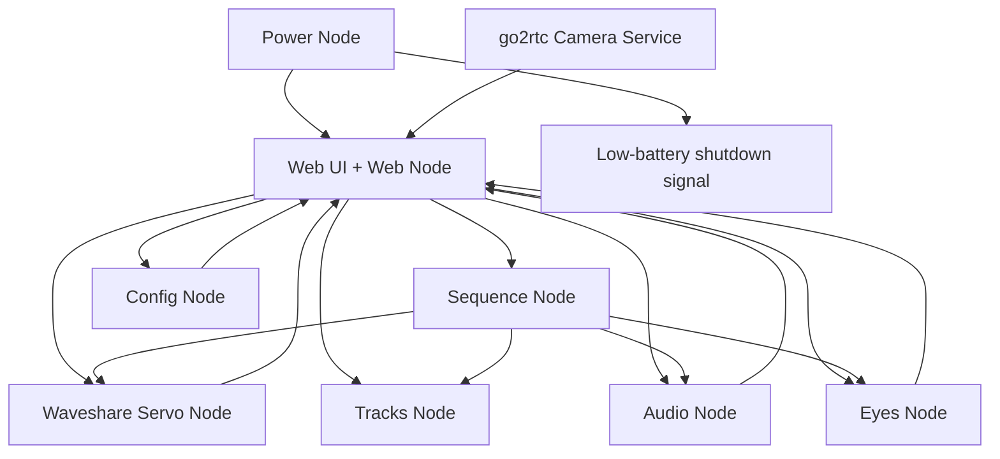

# WALL-E-DORA

WALL-E-DORA is a Dora-based robot control stack for a WALL-E-inspired build running on a Raspberry Pi and an RP2040 motor controller. It combines a mobile-friendly web UI, audio playback, eye animations, tracked movement, servo animation, battery monitoring, camera features, and choreographed action sequences into one modular system.

> This is not a polished general-purpose robotics kit. It is my firmware/software stack for my own WALL-E build. You are absolutely welcome to use it, study it, fork it, and adapt it for your own robot, but please do not expect product-level support, hand-holding, or guaranteed compatibility from me.

The project is organized as a set of small Dora nodes wired together in [`dataflow.yml`](dataflow.yml). The web node is the main user-facing entry point, but each hardware area stays isolated in its own node so the system is easier to understand, test, and evolve.

## What It Does

- Drive a tracked WALL-E robot from the browser or a gamepad
- Animate head, arms, door, and other SC-series servos
- Play WALL-E-style sounds and coordinate them with motion sequences
- Control eye GIFs and switch between expressive visual states
- Show a responsive web UI optimized for a phone mounted in-hand
- Provide servo diagnostics, calibration, and configuration tools
- Proxy a live USB camera feed through the existing HTTPS web app
- Save camera snapshots into an on-device photo gallery
- Offer optional face-follow behavior for head tracking
- Monitor battery voltage, current, power draw, charge estimate, and shutdown thresholds

## Highlights

- `Home / Showtime / Gallery` workflow in the web UI for fast operation
- Prebuilt action sequences for gestures, reactions, dances, and idle behavior
- Real-time telemetry over Dora + Apache Arrow
- Separate firmware for the RP2040 track controller
- Self-hosted HTTPS UI on port `8443`
- Systemd-friendly startup via [`service_runner.sh`](service_runner.sh)

## Architecture


```mermaid
graph TD
    Web[Web UI + Web Node]
    Sequence[Sequence Node]
    Servo[Waveshare Servo Node]
    Tracks[Tracks Node]
    Audio[Audio Node]
    Eyes[Eyes Node]
    Power[Power Node]
    Config[Config Node]
    Camera[go2rtc Camera Service]

    Web --> Sequence
    Web --> Servo
    Web --> Audio
    Web --> Eyes
    Web --> Config
    Web --> Tracks

    Sequence --> Servo
    Sequence --> Tracks
    Sequence --> Audio
    Sequence --> Eyes

    Servo --> Web
    Audio --> Web
    Eyes --> Web
    Power --> Web
    Config --> Web

    Camera --> Web
    Power --> Shutdown[Low-battery shutdown signal]
```

## Active Nodes

| Node | Purpose |
| --- | --- |
| `web` | HTTPS app, WebSocket bridge, camera proxy, photo gallery, face tracking, gamepad bridge |
| `sequence` | Timed action choreography across audio, eyes, servos, and tracks |
| `waveshare_servo` | Servo discovery, movement, diagnostics, config access, calibration |
| `tracks` | Browser/gamepad/manual track driving and sequence-driven movement |
| `audio` | Sound playback, volume control, current-sound state |
| `eyes` | Eye image/GIF control and available-image discovery |
| `power` | INA226-based battery telemetry and low-power shutdown logic |
| `config` | Shared settings persistence and update propagation |

## Repository Layout

```text
.
├── dataflow.yml              # Dora graph wiring
├── service_runner.sh         # systemd-friendly process launcher
├── nodes/
│   ├── audio/                # sound playback node
│   ├── config/               # shared settings/config node
│   ├── eyes/                 # eye display node
│   ├── gamepad/              # controller-related work
│   ├── power/                # battery monitoring node
│   ├── sequence/             # action sequencing node
│   ├── tracks/               # RP2040-backed drive node + firmware
│   ├── waveshare_servo/      # servo control + diagnostics
│   ├── web/                  # React UI + aiohttp node
│   └── ai_brain/             # experimental AI node work
├── docs/                     # supporting documentation
├── Makefile                  # common build/run targets
└── README.md
```

## Web Experience

The web app is served by the `web` node over HTTPS on port `8443`. The current UI is built around a few focused views:

- `Home`: quick access to sounds and eyes
- `Showtime`: large action buttons for scenes and gestures
- `Gallery`: saved camera snapshots
- Servo debug pages: per-servo control and diagnostics

The web node also proxies the camera service and exposes:

- `GET /camera/snapshot.jpg`
- `GET /camera/stream.mjpeg`
- `GET /api/photos`
- `POST /api/photos/capture`
- `GET /api/face-tracking`
- `POST /api/face-tracking`

## Quick Start

### Prerequisites

- Python `3.12+`
- `uv`
- `pnpm`
- Dora installed locally
- Node.js for frontend builds
- Hardware-specific system dependencies as described in the node READMEs

### Setup

```bash
python -m venv .venv
source .venv/bin/activate
uv pip install -e .
```

### Run The Full Stack

```bash
make run
```

Equivalent:

```bash
dora run dataflow.yml --uv
```

### Build Frontend Assets

```bash
make web/build
```

Watch mode during UI work:

```bash
make web/build-watch
```

### Build Or Flash Track Firmware

```bash
make tracks/build
make tracks/flash
make tracks/update
```

## Service / Robot Ops

For robot deployment, the stack is commonly started through [`service_runner.sh`](service_runner.sh), which wraps:

```bash
/home/mneuhaus/.dora/bin/dora run dataflow.yml --uv
```

The repository also includes convenience targets for generating and installing a systemd unit:

```bash
make service/install
make service/logs
make service/uninstall
```

## Development Workflow

### Run Tests

```bash
pytest -q
```

Or target a node:

```bash
pytest nodes/<node>/tests -q
```

### Lint / Format

```bash
ruff check .
ruff format .
```

### Common Expectations

- Keep node READMEs in sync with interface changes
- Use Apache Arrow arrays for node-to-node data
- Prefer structured payloads over JSON strings
- Keep `main.py` orchestration-focused and move logic into helpers/modules
- Mock hardware in tests where possible

## Dora Dataflow Notes

The canonical graph lives in [`dataflow.yml`](dataflow.yml). In the default setup:

- the `web` node fans out user actions
- the `sequence` node coordinates timed multi-node behavior
- the `waveshare_servo` node owns servo state and diagnostics
- the `tracks` node controls differential drive via serial to the RP2040
- the `audio`, `eyes`, and `power` nodes report back into the web UI

## Camera Stack

Camera handling is intentionally split:

- `go2rtc` handles the USB camera stream
- the `web` node proxies that stream over the same HTTPS origin as the UI
- face tracking runs in the `web` node so it can couple camera detections to head movement
- snapshots are stored on-device and surfaced through the gallery view

## Documentation Map

- [`nodes/web/README.md`](nodes/web/README.md)
- [`nodes/waveshare_servo/README.md`](nodes/waveshare_servo/README.md)
- [`nodes/tracks/README.md`](nodes/tracks/README.md)
- [`nodes/audio/README.md`](nodes/audio/README.md)
- [`nodes/eyes/README.md`](nodes/eyes/README.md)
- [`nodes/power/README.md`](nodes/power/README.md)
- [`nodes/config/README.md`](nodes/config/README.md)
- [`nodes/gamepad/README.md`](nodes/gamepad/README.md)
- [`CLAUDE.md`](CLAUDE.md)

## Current Status

This repository is actively evolving alongside the robot. The default `main` branch contains the latest integrated robot stack; adjacent directories and branches may contain experimental work, hardware bring-up, or side projects that are not part of the default Dora graph yet.

## License

MIT
