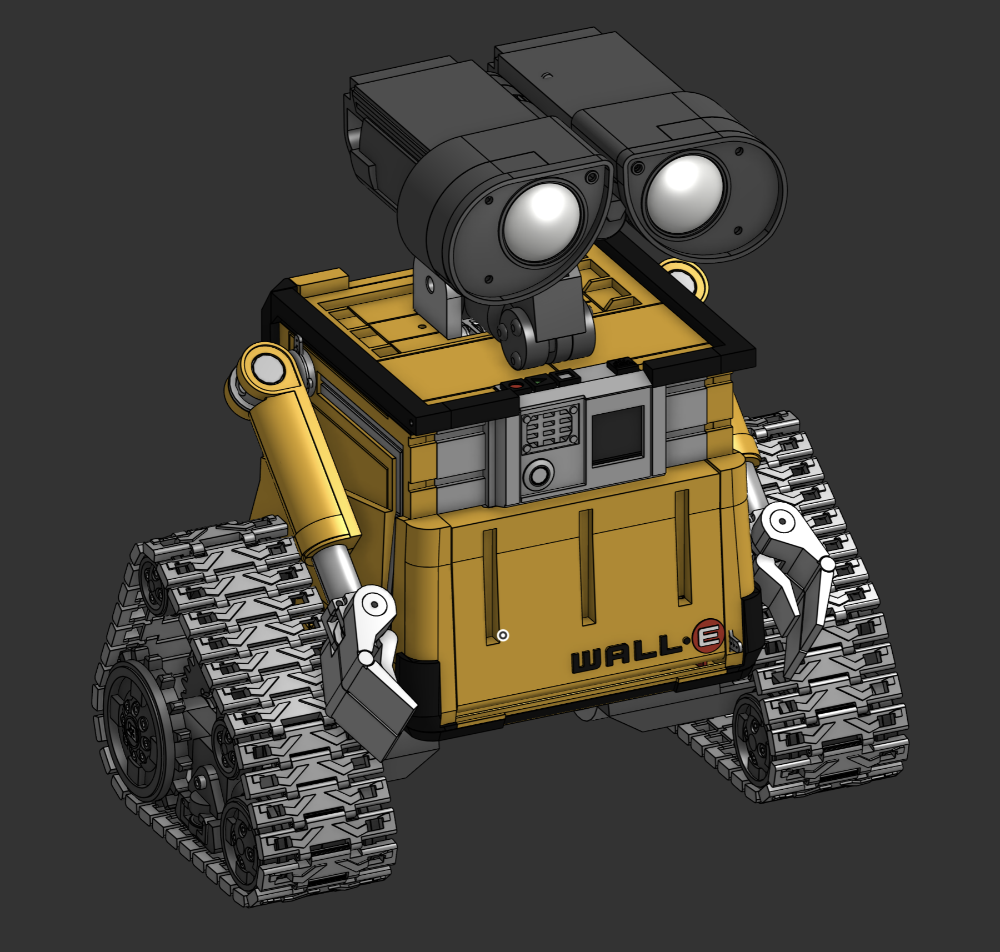
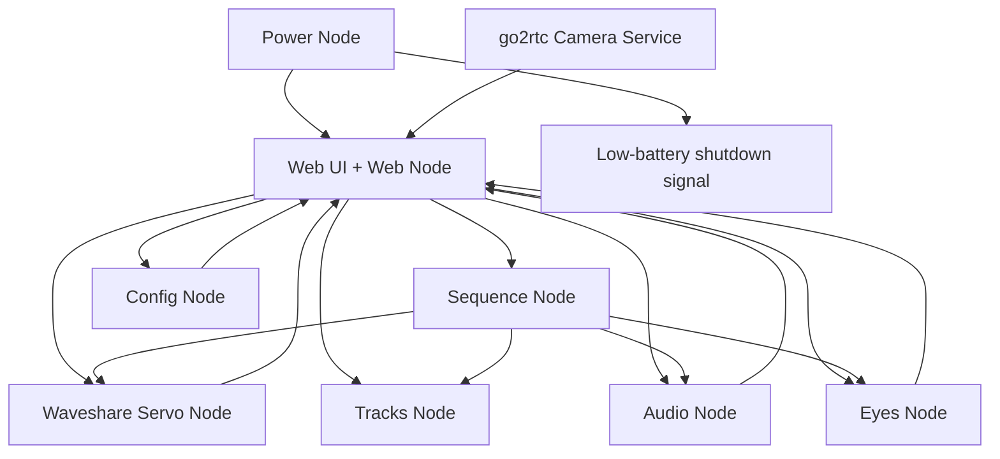

# WALL-E-DORA

<p align="center">
  
</p>

<p align="center">
  <a href="docs/media/wall-e-cad-preview.mp4">CAD video</a>
  ·
  <a href="https://cad.onshape.com/documents/e2006a749194244a0138595b/w/b0c916bba4469b0d0f3203c4/e/2251efc11f608df0d03058cb?renderMode=0&uiState=69b5abb2c2106f6b72489059">Onshape CAD</a>
</p>

WALL-E-DORA is a Dora-based robot control stack for a WALL-E-inspired build running on a Raspberry Pi CM4 with a Waveshare CM4-NANO-B carrier board plus an RP2040 motor controller. It combines a mobile-friendly web UI, audio playback, eye animations, tracked movement, servo animation, battery monitoring, camera features, and choreographed action sequences into one modular system.

> This is not a polished general-purpose robotics kit. It is my firmware/software stack for my own WALL-E build. You are absolutely welcome to use it, study it, fork it, and adapt it for your own robot, but please do not expect product-level support, hand-holding, or guaranteed compatibility from me.

The project is organized as a set of small Dora nodes wired together in [`dataflow.yml`](dataflow.yml). The web node is the main user-facing entry point, but each hardware area stays isolated in its own node so the system is easier to understand, test, and evolve.

## What It Does

- Drive a tracked WALL-E robot from the browser or a gamepad
- Animate head, arms, door, and other SC-series servos
- Play WALL-E-style sounds and coordinate them with motion sequences
- Control eye GIFs and switch between expressive visual states
- Show a responsive web UI optimized for a phone mounted in-hand
- Provide servo diagnostics, calibration, and configuration tools
- Proxy a live USB camera feed through the existing HTTPS web app
- Save camera snapshots into an on-device photo gallery
- Offer optional face-follow behavior for head tracking
- Monitor battery voltage, current, power draw, charge estimate, and shutdown thresholds

## Highlights

- `Home / Showtime / Gallery` workflow in the web UI for fast operation
- Prebuilt action sequences for gestures, reactions, dances, and idle behavior
- Real-time telemetry over Dora + Apache Arrow
- Separate firmware for the RP2040 track controller
- Self-hosted HTTPS UI on port `8443`
- Systemd-friendly startup via [`service_runner.sh`](service_runner.sh)

## Reference Hardware / BOM

This repository is built around one very specific WALL-E robot, so the most useful hardware section is a **reference build BOM**, not a universal shopping list. In other words: these are the parts and hardware assumptions the software is written around today. Some areas are tightly coupled to the code, others are deliberately flexible.

### Core Electronics

| Area | Reference Part / Family | Notes |
| --- | --- | --- |
| Main compute | **Raspberry Pi Compute Module 4 (CM4)** | This is the main Linux computer for the robot. It runs Dora, the HTTPS web UI, config, power monitoring, audio, camera proxying, face tracking, and the higher-level robot logic. |
| CM4 carrier board | **Waveshare CM4-NANO-B** | The CM4 is mounted on a CM4-NANO-B carrier. If someone wants to reproduce this build closely, this board matters because it defines the physical connectors and expansion layout around the compute module. |
| Drive microcontroller | RP2040 board, currently a **Seeed XIAO RP2040** style pinout | The track firmware under [`nodes/tracks/firmware`](nodes/tracks/firmware) is currently wired for a XIAO RP2040 pinout. This controller handles the low-level motor driving and safety timeout behavior. |
| Track motor driver | **Cytron MD13S** single-channel `30V / 13A` motor controller | The drive system uses Cytron MD13S hardware on the motor-control side. If the robot keeps one controller per motor, this is the part to match when reproducing the electrical drive stack closely. |
| Track drive | Differential track motors plus external motor driver stage | The software assumes skid-steer / differential drive, with the low-level control abstracted behind the RP2040 firmware and the Cytron driver layer. |
| Servo bus controller | Waveshare SC-series serial servo controller | Connected over USB serial to the Raspberry Pi. This is the hub for all bus servos used for head, arms, door, and similar articulated parts. |
| Bus servos | SC-series serial servos, currently tuned around **SC09-class** hardware | The servo node is built around the SC-series protocol and tooling. Diagnostics, EEPROM config reads, cloning, reset, and calibration all assume that family. |
| Eye display controllers | **Seeed XIAO ESP32S3** based eye-display boards | The eye firmware Makefile targets `esp32:esp32:XIAO_ESP32S3`. The eyes node treats these as small networked displays that receive GIF/JPG assets and display commands. |
| Battery monitor | **INA226** current/voltage sensor + **0.002 Ohm** shunt | Wired over I2C bus 1. The power node uses this for voltage, current, power, SoC, runtime estimation, and low-battery shutdown decisions. |
| Battery pack | **3S LiPo**, reference pack **2200 mAh** | The current power model assumes `11.1V` nominal, `12.6V` full, and roughly `9.9V` as the practical empty floor. |
| Power conversion | **Pololu S8V9F7** step-up / step-down regulator, `7.5V / 1.5A` | Useful wherever the robot needs a stable intermediate rail from the 3S battery pack. Including it here makes the power distribution side of the build much easier to reproduce. |
| Camera | USB webcam exposed as `/dev/video0` | Live video is handled by `go2rtc`, then proxied through the existing HTTPS web node. The current config expects MJPEG-capable USB camera hardware. |
| Audio amplifier | **Garosa TPA3110** dual-channel digital amplifier board, `2 x 15W` | This is the current stereo amplifier stage in the robot. Including it makes the audio chain much easier to replicate than just saying "some amp board". |
| Speakers | **MMOBIEL left/right replacement speaker set for MacBook Pro 13\" A1706 (2016-2017)** | The robot currently uses a repurposed left/right laptop speaker set rather than a generic hobby speaker module. This is useful context for anyone trying to match the physical sound profile and packaging constraints. |
| Audio output | Raspberry Pi analog headphones output feeding the Garosa TPA3110 amplifier and then the MMOBIEL speaker pair | The audio node currently prefers `plughw:CARD=Headphones,DEV=0`, so the build is presently biased toward the Pi's headphone output path rather than HDMI audio. |
| Operator input | Browser UI plus optional gamepad, currently an **8BitDo Ultimate MG** profile | The web UI is the primary control surface. A saved controller profile exists under [`config/gamepad_profiles`](config/gamepad_profiles) for an 8BitDo Ultimate MG. |

### What The Software Assumes Pretty Hard

These pieces are not impossible to change, but swapping them usually means touching code, config, or both:

- **SC-series servo bus hardware** rather than hobby PWM servos
- **An RP2040-based drive controller** that speaks the existing serial command protocol
- **Cytron MD13S-class motor driver hardware** in the current tracked drive stack
- **INA226-based battery telemetry** on I2C
- **A USB camera** handled by `go2rtc`
- **Network-addressable eye displays** that accept synced image assets

### What Is More Flexible

These parts can vary more without forcing a major rewrite:

- the exact tracked chassis and gearboxes behind the RP2040 + motor-driver stack
- the exact number of servos on the bus
- the exact USB camera model, as long as Linux + `go2rtc` can use it
- the exact gamepad model, as long as the browser can map it

### Scope Of This BOM

This section is intentionally focused on the **electronics / control BOM** that the repository actually knows about. It is **not yet** a full mechanical shopping list for every printed part, bearing, screw, cosmetic shell piece, or custom bracket in the robot body. If this project ever grows a full reproducible hardware package, that would deserve its own dedicated document.

### CAD / Mechanical Reference

The robot body itself is custom and easier to understand from the CAD than from prose alone. The current design reference lives in Onshape:

- [CAD preview video](docs/media/wall-e-cad-preview.mp4)
- [WALL-E CAD in Onshape](https://cad.onshape.com/documents/e2006a749194244a0138595b/w/b0c916bba4469b0d0f3203c4/e/2251efc11f608df0d03058cb?renderMode=0&uiState=69b5abb2c2106f6b72489059)

That CAD is the right place to look for the physical packaging of the tracks, body shell, eye assembly, arm geometry, and the custom fit between electronics and structure. The BOM section above intentionally stays focused on the hardware interfaces the software cares about most directly.

## Architecture


```mermaid
graph TD
    Web[Web UI + Web Node]
    Sequence[Sequence Node]
    Servo[Waveshare Servo Node]
    Tracks[Tracks Node]
    Audio[Audio Node]
    Eyes[Eyes Node]
    Power[Power Node]
    Config[Config Node]
    Camera[go2rtc Camera Service]

    Web --> Sequence
    Web --> Servo
    Web --> Audio
    Web --> Eyes
    Web --> Config
    Web --> Tracks

    Sequence --> Servo
    Sequence --> Tracks
    Sequence --> Audio
    Sequence --> Eyes

    Servo --> Web
    Audio --> Web
    Eyes --> Web
    Power --> Web
    Config --> Web

    Camera --> Web
    Power --> Shutdown[Low-battery shutdown signal]
```

## Active Nodes

| Node | Purpose |
| --- | --- |
| `web` | HTTPS app, WebSocket bridge, camera proxy, photo gallery, face tracking, gamepad bridge |
| `sequence` | Timed action choreography across audio, eyes, servos, and tracks |
| `waveshare_servo` | Servo discovery, movement, diagnostics, config access, calibration |
| `tracks` | Browser/gamepad/manual track driving and sequence-driven movement |
| `audio` | Sound playback, volume control, current-sound state |
| `eyes` | Eye image/GIF control and available-image discovery |
| `power` | INA226-based battery telemetry and low-power shutdown logic |
| `config` | Shared settings persistence and update propagation |

## Repository Layout

```text
.
├── dataflow.yml              # Dora graph wiring
├── service_runner.sh         # systemd-friendly process launcher
├── nodes/
│   ├── audio/                # sound playback node
│   ├── config/               # shared settings/config node
│   ├── eyes/                 # eye display node
│   ├── gamepad/              # controller-related work
│   ├── power/                # battery monitoring node
│   ├── sequence/             # action sequencing node
│   ├── tracks/               # RP2040-backed drive node + firmware
│   ├── waveshare_servo/      # servo control + diagnostics
│   ├── web/                  # React UI + aiohttp node
│   └── ai_brain/             # experimental AI node work
├── docs/                     # supporting documentation
├── Makefile                  # common build/run targets
└── README.md
```

## Web Experience

The web app is served by the `web` node over HTTPS on port `8443`. The current UI is built around a few focused views:

- `Home`: quick access to sounds and eyes
- `Showtime`: large action buttons for scenes and gestures
- `Gallery`: saved camera snapshots
- Servo debug pages: per-servo control and diagnostics

The web node also proxies the camera service and exposes:

- `GET /camera/snapshot.jpg`
- `GET /camera/stream.mjpeg`
- `GET /api/photos`
- `POST /api/photos/capture`
- `GET /api/face-tracking`
- `POST /api/face-tracking`

## Quick Start

### Prerequisites

- Python `3.12+`
- `uv`
- `pnpm`
- Dora installed locally
- Node.js for frontend builds
- Hardware-specific system dependencies as described in the node READMEs

### Setup

```bash
python -m venv .venv
source .venv/bin/activate
uv pip install -e .
```

### Run The Full Stack

```bash
make run
```

Equivalent:

```bash
dora run dataflow.yml --uv
```

### Build Frontend Assets

```bash
make web/build
```

Watch mode during UI work:

```bash
make web/build-watch
```

### Build Or Flash Track Firmware

```bash
make tracks/build
make tracks/flash
make tracks/update
```

## Service / Robot Ops

For robot deployment, the stack is commonly started through [`service_runner.sh`](service_runner.sh), which wraps:

```bash
/home/mneuhaus/.dora/bin/dora run dataflow.yml --uv
```

The repository also includes convenience targets for generating and installing a systemd unit:

```bash
make service/install
make service/logs
make service/uninstall
```

## Development Workflow

### Run Tests

```bash
pytest -q
```

Or target a node:

```bash
pytest nodes/<node>/tests -q
```

### Lint / Format

```bash
ruff check .
ruff format .
```

### Common Expectations

- Keep node READMEs in sync with interface changes
- Use Apache Arrow arrays for node-to-node data
- Prefer structured payloads over JSON strings
- Keep `main.py` orchestration-focused and move logic into helpers/modules
- Mock hardware in tests where possible

## Dora Dataflow Notes

The canonical graph lives in [`dataflow.yml`](dataflow.yml). In the default setup:

- the `web` node fans out user actions
- the `sequence` node coordinates timed multi-node behavior
- the `waveshare_servo` node owns servo state and diagnostics
- the `tracks` node controls differential drive via serial to the RP2040
- the `audio`, `eyes`, and `power` nodes report back into the web UI

## Camera Stack

Camera handling is intentionally split:

- `go2rtc` handles the USB camera stream
- the `web` node proxies that stream over the same HTTPS origin as the UI
- face tracking runs in the `web` node so it can couple camera detections to head movement
- snapshots are stored on-device and surfaced through the gallery view

## Documentation Map

- [`nodes/web/README.md`](nodes/web/README.md)
- [`nodes/waveshare_servo/README.md`](nodes/waveshare_servo/README.md)
- [`nodes/tracks/README.md`](nodes/tracks/README.md)
- [`nodes/audio/README.md`](nodes/audio/README.md)
- [`nodes/eyes/README.md`](nodes/eyes/README.md)
- [`nodes/power/README.md`](nodes/power/README.md)
- [`nodes/config/README.md`](nodes/config/README.md)
- [`nodes/gamepad/README.md`](nodes/gamepad/README.md)
- [`CLAUDE.md`](CLAUDE.md)

## Current Status

This repository is actively evolving alongside the robot. The default `main` branch contains the latest integrated robot stack; adjacent directories and branches may contain experimental work, hardware bring-up, or side projects that are not part of the default Dora graph yet.

## License

MIT
