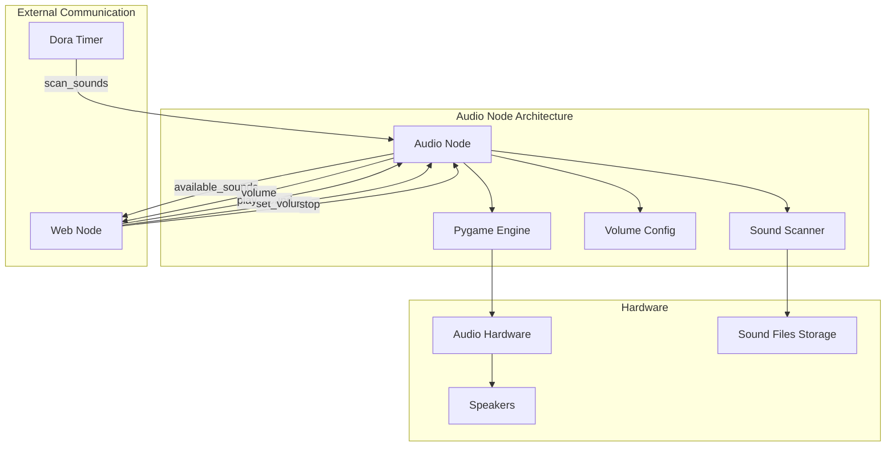

# Audio Node

## Purpose
The Audio Node provides sound capabilities for the WALL-E robot, allowing it to play voice clips, sound effects, and background music with volume control.

## Overview
The audio system manages playback of pre-recorded sounds including startup sequences, voice clips, and sound effects through the Dora framework. It replaces the previous ROS2-based implementation with a more lightweight and efficient approach.



## Hardware Setup
- **Audio Output**: Standard audio interface
- **Speaker**: 3W 4Ω speaker with amplifier
- **Sound Files**: Pre-recorded MP3s stored in package resources

## Functional Requirements

### Sound Playback
- Play MP3 sound files from a designated directory
- Support concurrent playback of multiple sounds
- Implement volume control across all sound channels
- Provide a startup sound sequence
- Stop all sounds on command

### Sound Management
- Scan and maintain a list of available sounds
- Persist volume settings between restarts
- Report current volume level to web interface
- Add new sounds without requiring code changes
- Support sound categorization (voice, effects, music)

## Available Sounds
| Filename            | Description                    | Duration |
|--------------------|--------------------------------|----------|
| startup.mp3        | Boot sequence sound            | 2.1s     |
| wall-e-1.mp3       | Main "Wall-E" voice clip       | 1.2s     |
| wall-e-2.mp3       | Curious "Wall-E" voice         | 1.0s     |
| wall-e-3.mp3       | Happy "Wall-E" voice           | 1.1s     |
| wall-e-4.mp3       | Questioning "Wall-E" voice     | 1.3s     |
| gorgeus.mp3        | "Gorgeous" admiration          | 1.0s     |
| whoa.mp3           | "Whoa" surprise sound          | 0.8s     |
| background-music.mp3| Ambient background music       | 60.0s    |
| destruct.mp3       | Destruction sound effect       | 1.5s     |
| grunting-mechanical.mp3 | Mechanical movement sound | 1.2s     |
| too-much-garbage.mp3 | Garbage overload sound      | 2.0s     |
| ten-seconds.mp3    | Countdown voice                | 3.0s     |

## Technical Requirements

### Audio System
- Use Pygame for sound playback
- Support multiple audio channels
- Implement high-quality MP3 playback
- Ensure low latency response to playback commands
- Properly handle audio hardware errors

### Dora Node Integration
The Audio node connects to the Dora framework with these data flows:

#### Inputs
| Input ID        | Source               | Description                     |
|-----------------|----------------------|---------------------------------|
| play_sound      | web/play_sound       | Play specified sound file       |
| scan_sounds     | dora/timer/secs/3    | Trigger sound directory scan    |
| volume_tick     | dora/timer/secs/1    | Trigger volume reporting        |
| set_volume      | web/set_volume       | Set volume level (0-1.0)        |
| stop            | web/stop             | Stop all sound playback         |

#### Outputs
| Output ID         | Destination     | Description                    |
|-------------------|----------------|--------------------------------|
| available_sounds  | web            | List of available sound files   |
| volume            | web            | Current volume level (0-1.0)    |

### Example Usage with Dora
```python
# Play startup sound
node.send_output("play_sound", pa.array(["startup.mp3"]), metadata={})

# Set volume to 75%
node.send_output("set_volume", pa.array([0.75]), metadata={})

# Stop all sounds
node.send_output("stop", pa.array([]), metadata={})
```

## Getting Started

- Install dependencies:
```bash
pip install -e .
```

## Contribution Guide

- Format with [ruff](https://docs.astral.sh/ruff/):
```bash
ruff check . --fix
```

- Lint with ruff:
```bash
ruff check .
```

- Test with [pytest](https://github.com/pytest-dev/pytest)
```bash
pytest . # Test
```

## Future Enhancements
1. Support for text-to-speech generation
2. Audio recording capabilities
3. Sound effects processing (echo, pitch shifting, etc.)
4. Sound sequence scheduling
5. Support for additional audio formats (WAV, FLAC, etc.)

## License
Audio node's code is released under the MIT License.