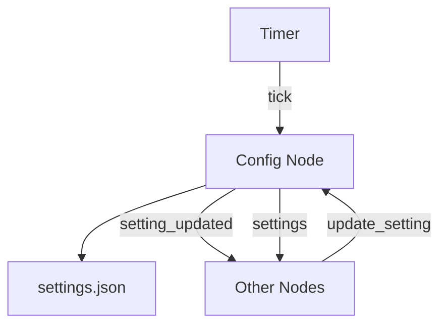

# Config Node

## Purpose
A central configuration management node that stores and manages all system settings in a structured JSON file.

## Overview
The Config node provides a centralized way to store, retrieve, and update configuration settings for the entire WALL-E-DORA system. It uses a hierarchical path-based approach to handle nested settings with support for dot notation (e.g., `servo.3.speed`).



## Functional Requirements
- Store configuration settings in a structured JSON file
- Support hierarchical settings using dot notation paths
- Handle both object (dictionary) and array-based settings
- Allow updates to individual settings without affecting others
- Notify other nodes when settings are updated
- Periodically broadcast all settings to interested nodes

## Technical Requirements
- Store settings in a human-readable JSON file in the project's config directory
- Support deep nesting of settings using dot notation
- Automatically create intermediate objects/arrays when setting deep paths
- Ensure thread-safe read/write operations
- Handle various data types (strings, numbers, booleans, objects, arrays)
- Provide robust error handling for malformed settings requests

## Dora Node Integration

### Inputs
- `update_setting`: Receives a path and value to update a specific setting
  - Format: `{"path": "servo.3.speed", "value": 100}`
- `tick`: Regular timer input to broadcast all settings

### Outputs
- `setting_updated`: Emits when a setting is updated
  - Format: `{"path": "servo.3.speed", "value": 100}`
- `settings`: Emits the entire configuration periodically (on tick event)

## Getting Started

- Install it with pip:

```bash
pip install -e .
```

- Make sure the `config` directory exists in the project root:

```bash
mkdir -p /path/to/project/config
```

- The node will automatically create a `settings.json` file if it doesn't exist

## Contribution Guide

- Format with [ruff](https://docs.astral.sh/ruff/):

```bash
ruff check . --fix
```

- Lint with ruff:

```bash
ruff check .
```

- Test with [pytest](https://github.com/pytest-dev/pytest)

```bash
pytest . # Test
```

## Usage Examples

### Updating a setting
To update a servo speed setting:
```
Send to input "update_setting": {"path": "servo.3.speed", "value": 100}
```

### Listening for settings
Other nodes can listen to the `settings` output to get the complete configuration or subscribe to `setting_updated` to be notified of specific changes.

## Future Enhancements
- Add schema validation for settings
- Implement setting types and constraints
- Add versioning for configuration files
- Support configuration templates/presets
- Implement configuration migration between versions

## License

Config node's code is released under the MIT License