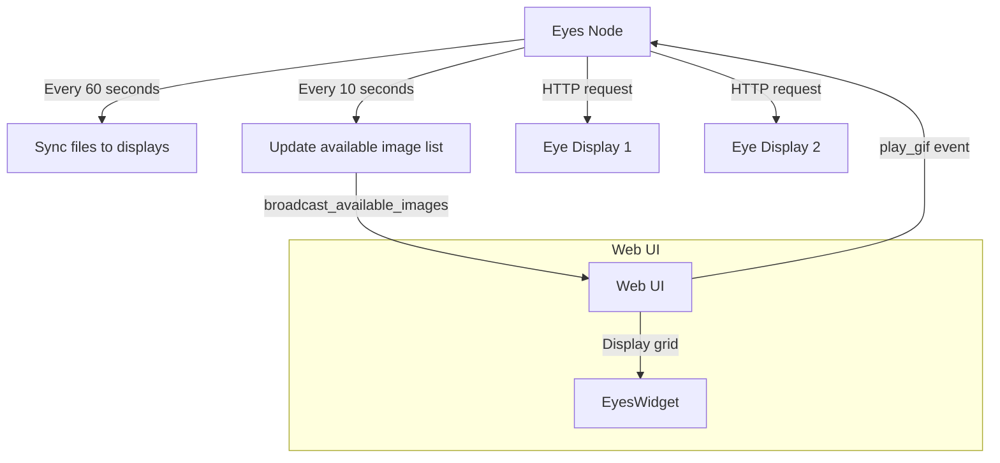

# Eyes Node

## Purpose
The Eyes node is responsible for managing the synchronization and display of GIF/JPG images on connected WALL-E eye displays. It periodically syncs images from the local `gif_sync` directory to eye displays and allows on-demand image selection via the web interface.

## Overview
This node handles automatic synchronization of image files and provides an interface for displaying specific images on the eye displays in real-time.



## Functional Requirements
- Periodically check for updated GIF/JPG images in the node's gif_sync directory
- Automatically discover and connect to eye displays on the network (fixed IPs: 10.42.0.156, 10.42.0.218)
- Synchronize images to all connected displays
- Allow real-time selection and display of images via Web UI
- Report success/failure of operations
- Broadcast available images list for the web interface
- Handle play requests from the web node

## Technical Requirements
- Integrate with the Dora dataflow system
- Maintain extended timeouts (20-60s) for resource-constrained ESP32 displays
- Support GIF and JPG image formats
- Provide robust error handling for network issues
- Maintain a clean separation of concerns between event handling and domain logic
- Follow the project's defined node architecture pattern

## Dora Node Integration

### Inputs
| Input ID      | Source                | Description                               |
|---------------|-----------------------|-------------------------------------------|
| TICK          | dora/timer/secs/60    | Trigger for periodic file synchronization |
| list_images   | dora/timer/secs/10    | Trigger to update available image list    |
| play_gif      | web/play_gif          | Request to display a specific image/GIF   |

### Outputs
| Output ID         | Destination | Description                               |
|-------------------|-------------|-------------------------------------------|
| available_images  | web         | List of available images sent to web node |

## Getting Started

- Install it with pip:

```bash
pip install -e .
```

- Ensure the `gif_sync` directory contains the GIF images you want to display

## Contribution Guide

- Format code:
```bash
ruff format .
```

- Lint code:
```bash
ruff check .
```

- Test with [pytest](https://docs.pytest.org/):
```bash
pytest .
```

## Future Enhancements
- Add ability to control which images are displayed via Dora events
- Implement status reporting via output events
- Add support for scheduling different images at different times
- Implement manual sync trigger via input events
- Add a web interface for managing images

## License

Eyes node's code is released under the MIT License
