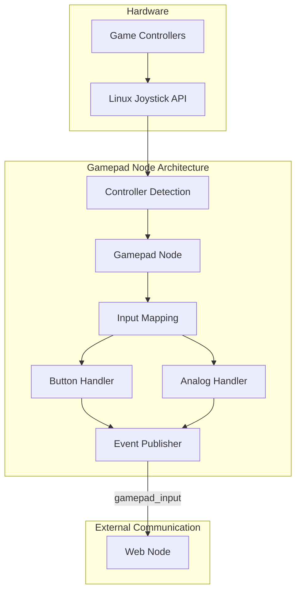

# Gamepad Node

## Purpose
The Gamepad Node interfaces with physical game controllers, providing intuitive input methods for controlling the robot's movement and functions.

## Overview
The gamepad node enables physical game controller input for the Wall-E robot, acting as a bridge between standard USB/Bluetooth controllers and the robot's control system. It handles button and analog stick inputs, normalizes them, and publishes them to the system.



## Functional Requirements

### Controller Support
- Interface with standard gamepad controllers
- Support button and analog stick inputs
- Map controller inputs to robot functions
- Handle controller connection/disconnection events
- Support multiple controller types

### Input Mapping
- Map analog sticks to robot movement
- Assign buttons to specific functions (sounds, actions)
- Support runtime remapping of controls
- Provide controller status information
- Implement deadzone handling for analog inputs

## Technical Requirements

### Hardware Interface
- Use Linux joystick API for controller access
- Support standard USB game controllers
- Handle driver issues gracefully
- Support multiple connected controllers
- Implement controller identification

### Input Processing
- Filter and normalize analog inputs
- Debounce button inputs
- Scale analog values appropriately
- Handle connection loss gracefully
- Support different controller layouts

### Dora Node Integration

The gamepad node reads raw controller events and publishes them. The `web` node consumes these raw events and emits specific `GAMEPAD_*` events for other nodes to use.

#### Outputs
| Output ID      | Destination | Description                                      |
|----------------|-------------|--------------------------------------------------|
| gamepad_input  | *internal*  | Raw controller input events (consumed by web node) |

### Controller Event Format

Raw events from this node are simple strings representing the event details (e.g., `('BUTTON', 'FACE_1', True)`). The `web` node processes these and emits structured `GAMEPAD_*` events like:

```json
{
  "output_id": "GAMEPAD_FACE_1",
  "data": [1],
  "metadata": {}
}
```
or
```json
{
  "output_id": "GAMEPAD_LEFT_ANALOG_STICK_X",
  "data": [0.75],
  "metadata": {}
}
```

## Supported Controllers

The node supports many standard controllers including:
- Xbox controllers
- PlayStation controllers
- Generic USB gamepads
- 8BitDo controllers

### Supported Events

#### Button Events
- FACE_1, FACE_2, FACE_3, FACE_4
- LEFT_SHOULDER, RIGHT_SHOULDER
- LEFT_SHOULDER_BOTTOM, RIGHT_SHOULDER_BOTTOM
- SELECT, START, HOME
- LEFT_ANALOG_BUTTON, RIGHT_ANALOG_BUTTON
- DPAD_UP, DPAD_DOWN, DPAD_LEFT, DPAD_RIGHT
- MISCBUTTON_1, MISCBUTTON_2

#### Analog Events
- LEFT_ANALOG_STICK_X, LEFT_ANALOG_STICK_Y
- RIGHT_ANALOG_STICK_X, RIGHT_ANALOG_STICK_Y
- LEFT_TRIGGER, RIGHT_TRIGGER

## Getting Started

- Install dependencies:
```bash
pip install -e .
```

## Contribution Guide

- Format code:
```bash
ruff format .
```

- Lint code:
```bash
ruff check .
```

- Test with [pytest](https://docs.pytest.org/):
```bash
pytest .
```

## Future Enhancements
1. Bluetooth controller support
2. Custom controller profiles
3. Controller vibration feedback
4. Support for specialty controllers (flight sticks, etc.)
5. Multiple simultaneous controller support

## License
Gamepad node's code is released under the MIT License.
