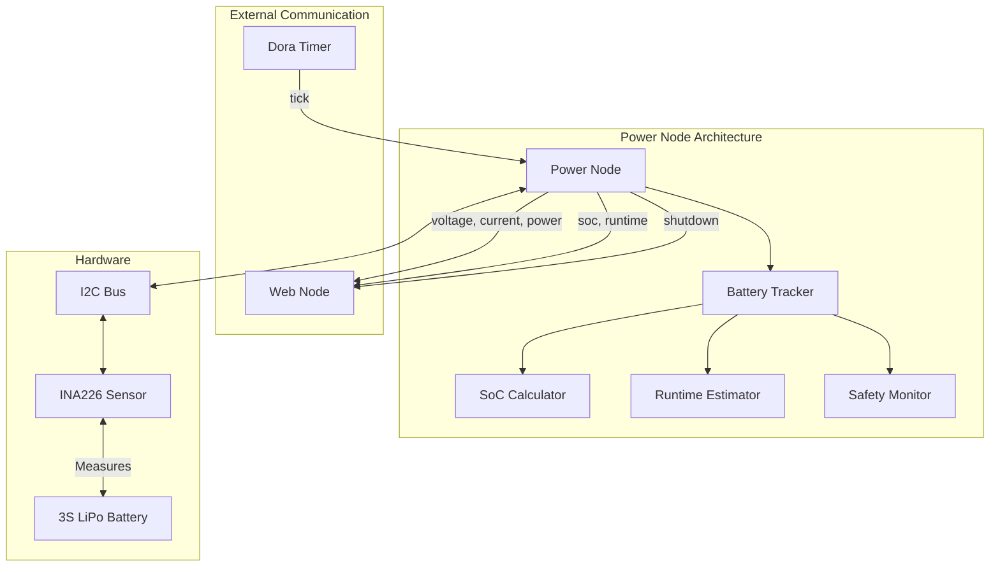

# Power Node

## Purpose
The Power Node monitors the robot's battery status and power consumption, providing critical information for operation and safety shutdowns at low battery levels.

## Overview
The power package provides battery monitoring and power management for the Wall-E robot using an INA226 current/voltage sensor. It tracks battery state, estimates remaining runtime, and implements safety shutdown at low battery levels.



## Hardware Requirements
- INA226 current/voltage sensor
- I2C connection to Raspberry Pi (bus 1)
- 12V LiPo battery system (3S configuration)
- Shunt resistor: 0.002Ω

## Functional Requirements

### Power Monitoring
- Measure battery voltage, current, and power consumption
- Calculate state of charge (SoC) percentage
- Estimate remaining runtime based on current power usage
- Trigger automatic shutdown at critical battery levels (10%)
- Report all power metrics to web interface

### Battery Management
- Implement accurate SoC calculation through voltage and coulomb counting
- Apply appropriate smoothing to power readings
- Track battery discharge patterns
- Provide alerts at specific battery thresholds (50%, 25%, 10%)

## Configuration

### INA226 Settings
| Register | Value    | Description                    |
|----------|----------|--------------------------------|
| Config   | 0x4127   | 128 samples avg, 8.244ms conv  |
| Cal      | 0x15E7   | Calibrated for 15A max        |
| Mask/En  | 0x4527   | Continuous measurements        |

### Battery Specifications
| Parameter          | Value | Description              |
|-------------------|-------|--------------------------|
| Nominal Voltage   | 11.1V | 3S Li-ion configuration |
| Maximum Voltage   | 12.6V | 4.2V per cell           |
| Minimum Voltage   | 9.0V  | 3.0V per cell           |
| Capacity         | 2.5Ah | Per cell capacity        |
| Shutdown Threshold| 10%   | Auto shutdown trigger    |

## Technical Requirements

### Hardware Interface
- Interface with INA226 current/voltage sensor via I2C
- Support 3S Li-ion battery pack (11.1V nominal)
- Configure sensor for appropriate measurement ranges
- Implement sensor redundancy or error detection

### Software Implementation
- Use rolling window averaging for stable readings
- Implement state of charge estimation algorithm
- Calculate remaining runtime based on power consumption trends
- Properly handle sensor communication errors
- Send regular updates to the web interface

### Dora Node Information

The power node connects to the Dora framework with these data flows:

#### Inputs
| Input ID | Source           | Description               |
|----------|------------------|---------------------------|
| tick     | dora/timer/secs/10 | Regular update trigger |

#### Outputs
| Output ID | Destination | Description                    |
|-----------|------------|--------------------------------|
| voltage   | web        | Battery voltage measurement     |
| current   | web        | Battery current measurement     |
| power     | web        | Power consumption in watts      |
| soc       | web        | Battery state of charge (%)     |
| runtime   | web        | Estimated remaining runtime     |
| shutdown  | web        | Shutdown signal at low battery  |

## Example Dataflow Configuration

Below is an example dataflow configuration integrating the power node:

```yaml
nodes:
  - id: power
    path: power/power/main.py
    inputs:
      tick: dora/timer/secs/10
    outputs:
      - voltage
      - current
      - power
      - soc
      - runtime
      - shutdown

  - id: web
    path: web/web/main.py
    inputs:
      tick: dora/timer/millis/100
      voltage: power/voltage
      current: power/current
      power: power/power
      soc: power/soc
      runtime: power/runtime
      shutdown: power/shutdown
    outputs:
      - slider_input
```

## Getting Started

- Install dependencies:
```bash
pip install -e .
```

## Contribution Guide

- Format with [ruff](https://docs.astral.sh/ruff/):
```bash
ruff check . --fix
```

- Lint with ruff:
```bash
ruff check .
```

- Test with [pytest](https://github.com/pytest-dev/pytest)
```bash
pytest . # Test
```

## Future Enhancements
1. Battery health monitoring
2. Charging status detection and reporting
3. Power consumption logging and analysis
4. Multiple battery support
5. Power saving modes based on battery level

## License
Power node's code is released under the MIT License.