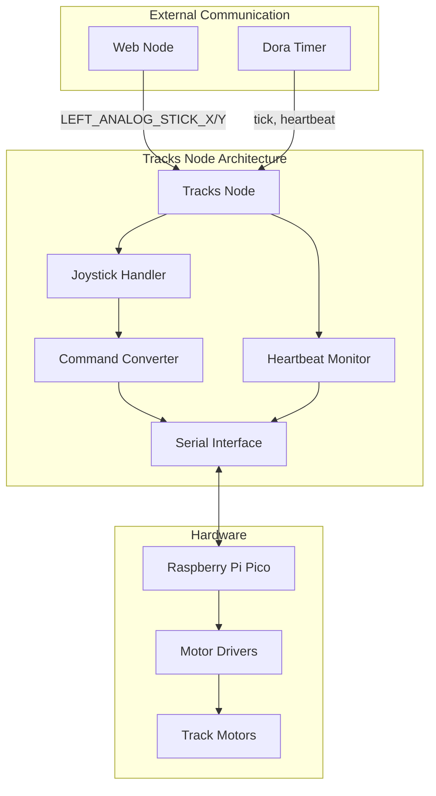

# Tracks Node

## Purpose
The Tracks Node controls the robot's movement by interfacing with motor controllers to drive the tracks, translating joystick inputs into appropriate motor commands.

## Overview
The tracks node manages Wall-E's mobility system by communicating with a Raspberry Pi Pico (RP2040) microcontroller that directly controls the track motors. It converts high-level joystick inputs into differential drive commands suitable for controlling the robot's movement.



## Functional Requirements

### Movement Control
- Translate joystick X/Y inputs to differential drive commands
- Support variable speed control for both tracks
- Implement smooth acceleration and deceleration
- Provide emergency stop functionality
- Support precise turning and movement control

### Hardware Interface
- Communicate with RP2040 (Raspberry Pi Pico) microcontroller via serial
- Send regular heartbeat signals to ensure connection
- Process movement commands with appropriate timing
- Handle feedback from motor controllers
- Support firmware updates to the microcontroller

## Technical Requirements

### Communications
- Use serial communication at 115200 baud
- Implement reliable command protocol with error checking
- Support bidirectional communication with microcontroller
- Handle communication errors gracefully
- Implement asynchronous serial reading for status updates

### Movement Algorithms
- Convert joystick inputs to linear and angular velocity
- Implement proper scaling for smooth control
- Apply acceleration limits for smooth movement
- Ensure safe movement speed limits
- Support differential steering algorithms

### Firmware Integration
- Provide compatible firmware for RP2040 microcontroller
- Implement robust hardware control on microcontroller
- Support over-the-wire firmware updates
- Include motor safety limits in firmware
- Ensure reliable startup sequence

### Dora Node Integration

The tracks node connects to the Dora framework with these data flows:

#### Inputs
| Input ID                    | Source                         | Description                     |
|-----------------------------|--------------------------------|---------------------------------|
| tick                        | dora/timer/millis/33           | Regular update trigger          |
| heartbeat                   | dora/timer/secs/1              | Connection maintenance signal   |
| GAMEPAD_LEFT_ANALOG_STICK_X | web/GAMEPAD_LEFT_ANALOG_STICK_X| Joystick X-axis input (-1 to 1) |
| GAMEPAD_LEFT_ANALOG_STICK_Y | web/GAMEPAD_LEFT_ANALOG_STICK_Y| Joystick Y-axis input (-1 to 1) |
| *setting_updated*           | *config/setting_updated*       | *(Future) Setting update notification* |

## Firmware Architecture

The RP2040 firmware implements:
- Serial communication protocol
- PWM motor control
- Safety timeout mechanism
- Differential drive calculation
- Current monitoring

### Command Protocol
Commands sent to the RP2040 follow this format:
```
command <param1> <param2>...
```

Examples:
- `move 100 50` - Move with linear velocity 100, angular velocity 50
- `heartbeat` - Connection maintenance signal
- `stop` - Emergency stop

## Getting Started

- Install dependencies:
```bash
pip install -e .
```

- Build and flash firmware:
```bash
make tracks/build
make tracks/flash
```

## Contribution Guide

- Format code:
```bash
ruff format .
```

- Lint code:
```bash
ruff check .
```

- Test with [pytest](https://docs.pytest.org/):
```bash
pytest .
```

## Future Enhancements
1. Autonomous navigation capabilities
2. Path planning and execution
3. Obstacle detection and avoidance
4. Speed governor based on battery level
5. Support for different drive modes (precision, sport, etc.)

## License
Tracks node's code is released under the MIT License.
