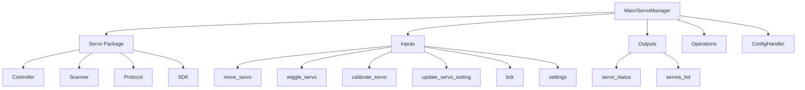

# Waveshare Servo Node

## Purpose
This node provides control and management for Waveshare servo motors connected to the WALL-E-DORA robot. It handles servo discovery, calibration, movement, and configuration while integrating with the central config system.

## Overview
The Waveshare Servo node manages all servo-related operations through a clean, modular architecture:



## Code Structure
The node follows a clean, modular architecture with each component having a single responsibility:

### Root Directory
- `main.py`: Entry point and ServoManager class
- `config_handler.py`: Configuration management
- `event_processor.py`: Utility for extracting event data
- `operations.py`: Internal operation handlers
- `models.py`: Re-export for backward compatibility

### servo/ Directory
All servo-specific functionality:
- `controller.py`: The main Servo class
- `models.py`: ServoSettings data class
- `scanner.py`: Serial connection management
- `port_finder.py`: Utility for finding serial ports
- `discovery.py`: Servo discovery functions
- `wiggle.py`: Servo wiggle operation
- `calibrate.py`: Servo calibration operation

#### servo/protocol/ Subdirectory
Low-level servo command implementation:
- Command implementations (ping, position, ID, text)

#### servo/sdk/ Subdirectory 
Low-level servo communication SDK:
- SDK components for SCS protocol

### inputs/ Directory
All event handlers for incoming events:
- One file per input event type (move_servo, wiggle_servo, etc.)

### outputs/ Directory
Functions for sending data to other nodes:
- broadcast_servo_status, broadcast_servos_list

## Functional Requirements
- Scan and discover connected servo motors
- Assign unique IDs to new servos (ID 1 gets automatically reassigned)
- Move servos to specified positions with controlled speed
- Wiggle servos for physical identification
- Calibrate servos by testing min/max range
- Store and retrieve servo configuration (aliases, position limits, etc.)
- React to configuration changes from other nodes
- Broadcast servo status for UI consumption

## Technical Requirements
- Connect to Waveshare servo controller via serial port
- Send properly formatted commands to servos via serial
- Manage servo settings using the central config system
- Handle servo inversions for motors mounted in opposite directions
- Ensure settings persistence across restarts
- Perform periodic scanning for new servos
- Validate position requests against calibrated limits

## Dora Node Integration

### Inputs
- `move_servo`: Move a servo to specified position
- `wiggle_servo`: Wiggle a servo for identification
- `calibrate_servo`: Calibrate a servo's position limits
- `update_servo_setting`: Update a specific servo setting
- `tick`: Periodic trigger for servo scanning
- `settings`: Receive broadcast of all settings
- `setting_updated`: Receive notification of a specific setting change

### Outputs
- `servo_status`: Status update for a single servo
- `servos_list`: List of all discovered servos
- `update_setting`: Send setting updates to config node

## Getting Started
1. Connect the Waveshare servo controller to a USB port
2. Connect servo motors to the controller
3. Start the node as part of the WALL-E-DORA system

## Architecture Details

### Key Components
- **ServoManager**: Main orchestrator that manages the servo ecosystem
- **Servo**: Represents a single servo with all its operations
- **ServoScanner**: Handles discovery of servos via serial port
- **ConfigHandler**: Interfaces with the config node for settings management
- **ServoSettings**: Data class for servo configuration parameters
- **Protocol Implementations**: Low-level servo command implementation
- **Input Handlers**: Dedicated handlers for each input event type
- **Output Broadcasters**: Functions for sending data to other nodes

### Key Features
- Clean architecture with separation of concerns
- Single-responsibility principle applied to all files
- Input/Output pattern for clear data flow
- Domain-driven organization with servo-related code in one package
- Automatic ID reassignment for new servos (avoids ID conflicts)
- Local caching of settings for performance
- Event-driven architecture for responsive behavior
- Proper error handling and logging

## Contribution Guide
- Format with [ruff](https://docs.astral.sh/ruff/):
```bash
ruff check . --fix
```

- Lint with ruff:
```bash
ruff check .
```

- Test with [pytest](https://github.com/pytest-dev/pytest)
```bash
pytest . # Test
```

## Future Enhancements
- Add multi-servo group movement capability
- Implement servo movement sequences/animations
- Add position feedback from servos (if hardware supports it)
- Improve servo discovery with more robust identification
- Add support for different servo controller hardware

## License
Waveshare Servo node's code is released under the MIT License.