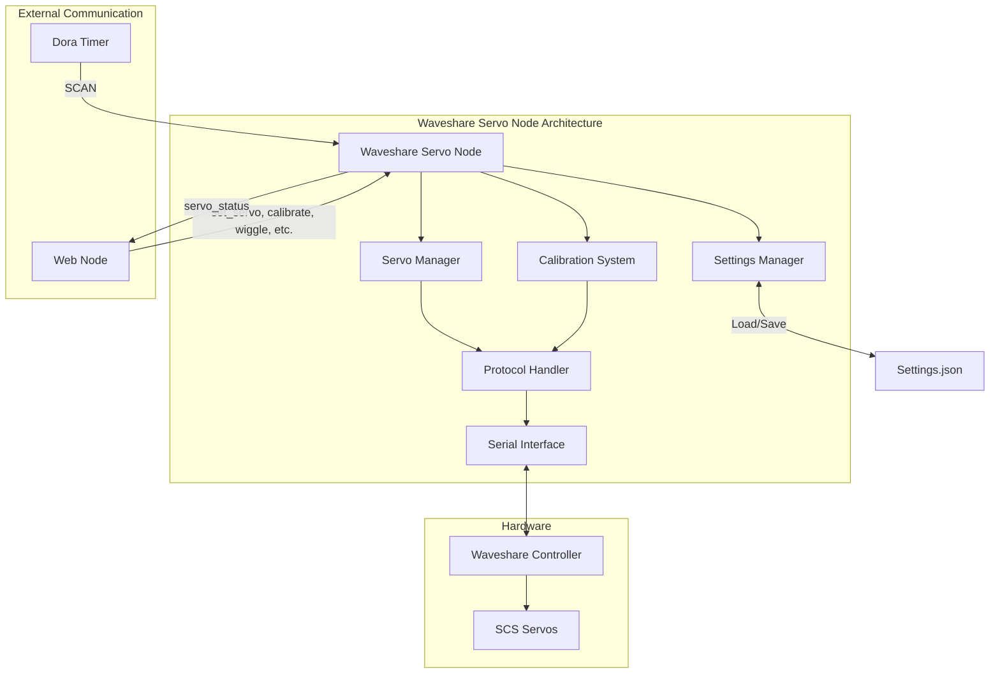

# Waveshare Servo Node

## Purpose
The Waveshare Servo Node controls servo motors for animatronic movements, allowing precise positioning of the robot's movable parts with proper calibration and safety features.

## Overview
The waveshare_servo node manages all animatronic movements for the Wall-E robot by controlling multiple SCS servos through a Waveshare servo controller. It provides precise position control, calibration, speed adjustment, and safety features to protect servos from damage.



## Functional Requirements

### Servo Control
- Control multiple SCS servos through a Waveshare controller
- Support position, speed, and acceleration control
- Implement calibration to set safe movement ranges
- Allow servo aliasing for friendly naming
- Provide servo status monitoring
- Support movement within calibrated limits only

### Servo Management
- Scan for connected servos and report status
- Support servo ID configuration
- Store and retrieve servo settings persistently
- Implement overload detection and protection
- Provide test movement functionality ("wiggle")

## Technical Requirements

### Hardware Interface
- Communicate with Waveshare servo controller via serial
- Support SCS servo protocol
- Implement proper error handling for communication issues
- Ensure safe servo movement within mechanical limits
- Support hot-plugging of servos

### Control Algorithms
- Apply speed ramping for smooth movement
- Implement safety checks for position limits
- Handle servo errors and overload conditions
- Support synchronized movement of multiple servos
- Implement proper torque control

### Configuration Management
- Store calibration data in JSON format
- Persist servo settings between restarts
- Support servo ID remapping
- Maintain aliases for human-readable control
- Implement proper error recovery

### Dora Node Integration

The waveshare_servo node connects to the Dora framework with these data flows:

#### Inputs
| Input ID       | Source                | Description                     |
|----------------|----------------------|---------------------------------|
| SCAN           | dora/timer/millis/300 | Trigger servo scan and status   |
| change_servo_id | web/change_servo_id  | Command to remap servo ID       |
| wiggle         | web/wiggle           | Trigger test movement           |
| calibrate      | web/calibrate        | Start calibration sequence      |
| set_servo      | web/set_servo        | Command to set servo position   |
| set_speed      | web/set_speed        | Set servo movement speed        |
| set_alias      | web/set_alias        | Set friendly name for servo     |

#### Outputs
| Output ID      | Destination | Description                    |
|----------------|------------|--------------------------------|
| servo_status   | web        | Status of all connected servos |

## Servo Protocol Details

The SCS servo protocol supports these key features:
- 1000000 baud communication rate
- 16-bit position values (0-4095)
- 16-bit speed values
- 8-bit acceleration values
- ID remapping with EPROM unlock/lock
- Position, speed, and load reading

## Getting Started

- Install dependencies:
```bash
pip install -e .
```

## Contribution Guide

- Format with [ruff](https://docs.astral.sh/ruff/):
```bash
ruff check . --fix
```

- Lint with ruff:
```bash
ruff check .
```

- Test with [pytest](https://github.com/pytest-dev/pytest)
```bash
pytest . # Test
```

## Future Enhancements
1. Support for coordinated multi-servo movements
2. Sequence recording and playback
3. PID control for precise positioning
4. Torque-based positioning for compliant movements
5. Advanced motion planning for natural movements

## License
Waveshare Servo node's code is released under the MIT License.