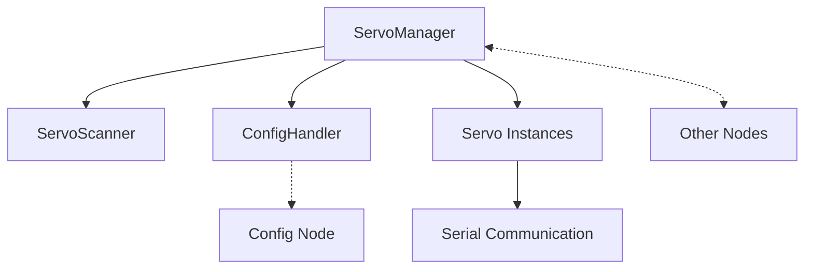

# Waveshare Servo Node

## Purpose
This node provides control and management for Waveshare servo motors connected to the WALL-E-DORA robot. It handles servo discovery, calibration, movement, and configuration while integrating with the central config system.

## Overview
The Waveshare Servo node manages all servo-related operations through a clean, modular architecture:



## Functional Requirements
- Scan and discover connected servo motors
- Assign unique IDs to new servos (ID 1 gets automatically reassigned)
- Move servos to specified positions with controlled speed
- Wiggle servos for physical identification
- Calibrate servos by testing min/max range
- Store and retrieve servo configuration (aliases, position limits, etc.)
- React to configuration changes from other nodes
- Broadcast servo status for UI consumption

## Technical Requirements
- Connect to Waveshare servo controller via serial port
- Send properly formatted commands to servos via serial
- Manage servo settings using the central config system
- Handle servo inversions for motors mounted in opposite directions
- Ensure settings persistence across restarts
- Perform periodic scanning for new servos
- Validate position requests against calibrated limits

## Dora Node Integration

### Inputs
- `move_servo`: Move a servo to specified position
- `wiggle_servo`: Wiggle a servo for identification
- `calibrate_servo`: Calibrate a servo's position limits
- `update_servo_setting`: Update a specific servo setting
- `scan_servos`: Trigger a manual scan for servos
- `config/settings`: Receive broadcast of all settings
- `config/setting_updated`: Receive notification of a specific setting change

### Outputs
- `servo_status`: Status update for a single servo
- `servos_list`: List of all discovered servos
- `update_setting`: Send setting updates to config node

## Getting Started
1. Connect the Waveshare servo controller to a USB port
2. Connect servo motors to the controller
3. Start the node as part of the WALL-E-DORA system

## Architecture Details

### Classes
- **ServoManager**: Main orchestrator that manages the servo ecosystem
- **ServoScanner**: Handles discovery of servos via serial port
- **ConfigHandler**: Interfaces with the config node for settings management
- **Servo**: Represents a single servo with all its operations
- **ServoSettings**: Data class for servo configuration parameters

### Key Features
- Automatic ID reassignment for new servos (avoids ID conflicts)
- Local caching of settings for performance
- Event-driven architecture for responsive behavior
- Clean separation of concerns with modular components
- Proper error handling and logging

## Contribution Guide
- Format with [ruff](https://docs.astral.sh/ruff/):
```bash
ruff check . --fix
```

- Lint with ruff:
```bash
ruff check .
```

- Test with [pytest](https://github.com/pytest-dev/pytest)
```bash
pytest . # Test
```

## Future Enhancements
- Add multi-servo group movement capability
- Implement servo movement sequences/animations
- Add position feedback from servos (if hardware supports it)
- Improve servo discovery with more robust identification
- Add support for different servo controller hardware

## License
Waveshare Servo node's code is released under the MIT License.