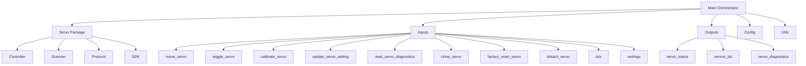

# Waveshare Servo Node

## Purpose
This node provides control and management for Waveshare SC-series servo motors connected to the WALL-E-DORA robot. It handles servo discovery, diagnostics, cloning, factory reset, calibration, movement, and configuration while integrating with the central config system.

## Overview
The Waveshare Servo node manages all servo-related operations through a clean, modular architecture:


```mermaid
graph TD
    A[Main Orchestrator] --> B[Servo Package]
    B --> B1[Controller]
    B --> B2[Scanner]
    B --> B3[Protocol]
    B --> B4[SDK]
    A --> C[Inputs]
    C --> C1[move_servo]
    C --> C2[wiggle_servo]
    C --> C3[calibrate_servo]
    C --> C4[update_servo_setting]
    C --> C5[read_servo_diagnostics]
    C --> C6[clone_servo]
    C --> C7[factory_reset_servo]
    C --> C8[detach_servo]
    C --> C9[tick]
    C --> C10[settings]
    A --> D[Outputs]
    D --> D1[servo_status]
    D --> D2[servos_list]
    D --> D3[servo_diagnostics]
    A --> E[Config]
    A --> F[Utils]
```

## Code Structure
The node follows a clean, modular architecture with each component having a single responsibility:

### Project Structure

```
waveshare_servo/
├── __init__.py           # Package definition
├── __main__.py           # Entry point for direct execution
├── entrypoint.py         # Dora entrypoint script
├── main.py               # Main orchestration module (no domain logic)
├── config/               # Configuration management
│   ├── __init__.py
│   └── handler.py        # ConfigHandler implementation
├── utils/                # Cross-cutting utilities
│   ├── __init__.py
│   └── event_processor.py # Event data extraction utilities
├── inputs/               # Input event handlers
│   ├── __init__.py
│   ├── move_servo.py
│   ├── wiggle_servo.py
│   ├── calibrate_servo.py
│   ├── update_servo_setting.py
│   ├── tick.py
│   ├── read_diagnostics.py
│   ├── clone_servo.py
│   ├── factory_reset_servo.py
│   ├── settings.py
│   └── setting_updated.py
├── outputs/              # Output event broadcasters
│   ├── __init__.py
│   ├── servo_status.py
│   ├── servos_list.py
│   └── servo_diagnostics.py
└── servo/                # Servo domain-specific functionality
    ├── __init__.py
    ├── controller.py     # The main Servo class
    ├── models.py         # Servo settings, status, model, and config data classes
    ├── registers.py      # Centralized SC-series register map
    ├── diagnostics.py    # Bulk register reads for status/model/config
    ├── operations.py     # Clone, factory reset, and auto-calibration helpers
    ├── scanner.py        # Serial connection management
    ├── port_finder.py    # Utility for finding serial ports
    ├── discovery.py      # Servo discovery functions
    ├── wiggle.py         # Servo wiggle operation
    ├── calibrate.py      # Servo calibration operation
    ├── protocol/         # Low-level servo command implementation
    │   ├── __init__.py
    │   ├── ping_command.py
    │   ├── position_command.py
    │   ├── id_command.py
    │   └── text_command.py
    └── sdk/              # Low-level servo communication SDK
        ├── __init__.py
        ├── port_handler.py
        ├── packet_handler.py
        ├── protocol_packet_handler.py
        ├── group_sync_read.py
        ├── group_sync_write.py
        └── scservo_def.py
```

### Key Files

- `main.py`: Orchestrates the interaction between inputs, servo domain logic, and outputs
- `config/handler.py`: Handles communication with the config node and maintains settings
- `utils/event_processor.py`: Utility for extracting and parsing event data from Dora events
- `inputs/*.py`: One file per input event type, each with a handle_* function 
- `outputs/*.py`: Functions for formatting and broadcasting data to other nodes
- `servo/*.py`: Servo-specific domain implementation files

## Functional Requirements
- Scan and discover connected SC-series servo motors
- Assign unique IDs to new servos (ID 1 gets automatically reassigned)
- Move servos to specified positions with controlled speed
- Wiggle servos for physical identification
- Read live diagnostics including position, speed, load, voltage, temperature, and moving state
- Read servo model metadata and full EEPROM/SRAM configuration on demand
- Compare diagnostics across all attached servos from a single overview request
- Clone EEPROM settings between servos
- Perform hardware factory reset back to the default profile
- Auto-calibrate min/max range using stall detection
- Store and retrieve servo configuration (aliases, position limits, etc.)
- React to configuration changes from other nodes
- Broadcast structured Arrow payloads for UI consumption

## Technical Requirements
- Connect to the Waveshare SC-series servo controller via serial port
- Send properly formatted SC-series register reads and writes via the Waveshare SDK
- Manage servo settings using the central config system
- Handle servo inversions for motors mounted in opposite directions
- Ensure settings persistence across restarts
- Perform periodic scanning for new servos
- Validate position requests against calibrated limits
- Emit structured Arrow arrays instead of JSON-string payloads

## Dora Node Integration

### Inputs
| Input ID                 | Source                         | Description                               |
|--------------------------|--------------------------------|-------------------------------------------|
| tick                     | dora/timer/secs/3              | Periodic trigger for servo scanning       |
| move_servo               | web/move_servo                 | Move a servo to specified position        |
| wiggle_servo             | web/wiggle_servo               | Wiggle a servo for identification         |
| calibrate_servo          | web/calibrate_servo            | Auto-calibrate a servo's physical limits  |
| read_servo_diagnostics   | web/read_servo_diagnostics     | Read live status, model, and full config for one or all servos |
| clone_servo              | web/clone_servo                | Clone EEPROM settings between two servos  |
| factory_reset_servo      | web/factory_reset_servo        | Factory reset a servo to hardware defaults|
| detach_servo             | web/detach_servo               | Disable torque for a specific servo       |
| update_servo_setting     | web/update_servo_setting       | Update a specific servo setting           |
| GAMEPAD_* (various)      | web/GAMEPAD_*                  | Gamepad button/axis events for mapping    |
| *settings*               | *config/settings*              | *(Future) Receive broadcast of all settings* |
| *setting_updated*        | *config/setting_updated*       | *(Future) Receive notification of setting change* |

### Outputs
| Output ID         | Destination     | Description                               |
|-------------------|-----------------|-------------------------------------------|
| servo_status      | web             | Live status update for a single servo     |
| servos_list       | web             | List of all discovered servos             |
| servo_diagnostics | web             | On-demand diagnostics payload for one or more servos |
| *update_setting*  | *config*        | *(Future) Send setting updates to config* |

## Getting Started
1. Connect the Waveshare servo controller to a USB port
2. Connect servo motors to the controller
3. Start the node as part of the WALL-E-DORA system

## Architecture Details

### Key Components
- **Main Orchestrator**: Coordinates the flow between inputs, actions, and outputs using a context dict pattern
- **Servo**: Represents a single servo with all its operations
- **ServoScanner**: Handles discovery of servos via serial port
- **ConfigHandler**: Interfaces with the config node for settings management
- **ServoSettings / ServoStatus / ServoConfig / ServoModel**: Structured data classes for persisted settings and live diagnostics
- **Protocol Implementations**: Low-level servo command implementation
- **Input Handlers**: Dedicated handlers for each input event type
- **Output Broadcasters**: Functions for sending data to other nodes

### Key Features
- **Dependency Injection via Context Dictionary**: Components share state via a context dict rather than class instances
- **Pure Orchestration in Main**: Main file focuses solely on orchestration with no domain logic
- **Single-Responsibility Principle**: Each file has exactly one responsibility
- **Modular Directory Structure**: Code organized into logical directories (inputs/, outputs/, config/, utils/, servo/)
- **Clear Dependency Hierarchy**: Well-defined dependencies between components
- **Clean Input/Output Pattern**: Clear data flow from inputs through domain logic to outputs
- **Domain-Driven Organization**: Servo-specific code isolated in dedicated directory
- **Event-Based Architecture**: Reactive processing based on Dora events
- **Proper Error Handling**: Comprehensive error handling and logging

## Contribution Guide
- Format code:
```bash
ruff format .
```

- Lint code:
```bash
ruff check .
```

- Test with [pytest](https://docs.pytest.org/):
```bash
pytest .
```

## Future Enhancements
- Add multi-servo group movement capability
- Implement servo movement sequences/animations
- Add position feedback from servos (if hardware supports it)
- Improve servo discovery with more robust identification
- Add support for different servo controller hardware

## License
Waveshare Servo node's code is released under the MIT License.
