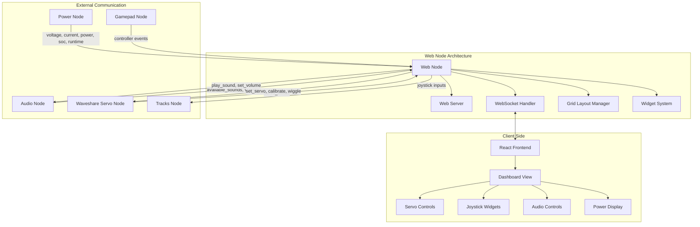

# Web Node

## Purpose
The Web Node serves as the central interface for controlling all aspects of the WALL-E robot. It provides a responsive dashboard with customizable widgets for servo control, sound playback, and movement.

## Overview
The web node functions as the primary user interface and central communication hub for the entire WALL-E robot system. It receives data from all other nodes, presents it through an interactive dashboard, and forwards user commands to the appropriate nodes.



## Functional Requirements

### User Interface
- Provide a web-based dashboard accessible on local network
- Support responsive design for mobile and desktop access
- Implement a grid-based widget system with drag-and-drop organization
- Support persistent layout storage between sessions
- Implement a secure HTTPS connection
- Include real-time status indicators for all robot subsystems

### Widget System
- Support servo control widgets with position sliders
- Implement joystick control widgets with servo assignment
- Provide sound playback widgets with volume control
- Include power monitoring widgets showing voltage, current, and battery status
- Support creation of custom widget configurations

### Node Communication
- Act as communication hub between all nodes
- Provide WebSocket interface for real-time updates to clients
- Forward control commands from UI to appropriate nodes
- Broadcast status updates from all nodes to connected clients

## Technical Requirements

### Frontend
- Use React with functional components and Hooks
- Implement BeerCSS with amber theme for consistent styling
- Use React Context API for state management
- Support at least Chrome and Firefox browsers
- Ensure mobile-friendly user interface

### Backend
- Use aiohttp for web server functionality
- Implement WebSocket handlers for real-time communication
- Store persistent data in JSON format
- Generate self-signed SSL certificates if not present
- Handle multiple concurrent client connections
- Process Dora events and translate them to UI updates

### Dora Node Integration

The web node connects to the Dora framework with these data flows:

#### Inputs
| Input ID          | Source                | Description                     |
|-------------------|----------------------|---------------------------------|
| tick              | dora/timer/millis/100 | Regular UI update trigger      |
| voltage           | power/voltage        | Battery voltage measurement     |
| current           | power/current        | Battery current measurement     |
| power             | power/power          | Power consumption in watts      |
| soc               | power/soc            | Battery state of charge (%)     |
| runtime           | power/runtime        | Estimated remaining runtime     |
| shutdown          | power/shutdown       | Shutdown signal at low battery  |
| available_sounds  | audio/available_sounds| List of available sound files  |
| servo_status      | waveshare_servo/servo_status | Servo status information |

#### Outputs
| Output ID          | Destination      | Description                     |
|--------------------|-----------------|----------------------------------|
| slider_input       | *               | Generic slider widget value      |
| play_sound         | audio           | Sound file to play               |
| set_volume         | audio           | Volume level to set              |
| stop               | audio           | Stop sound playback              |
| LEFT_ANALOG_STICK_X| tracks          | X-axis movement control          |
| LEFT_ANALOG_STICK_Y| tracks          | Y-axis movement control          |
| set_servo          | waveshare_servo | Servo position command           |
| wiggle             | waveshare_servo | Trigger servo test movement      |
| calibrate          | waveshare_servo | Trigger servo calibration        |
| set_speed          | waveshare_servo | Servo speed setting              |
| set_alias          | waveshare_servo | Set friendly name for servo      |

## Frontend Architecture

The web interface follows a consistent component and file naming structure to improve code organization and maintainability.

### Component Types and Naming Conventions

All components use PascalCase with a consistent suffix that indicates their purpose:

- **Widgets** (`*Widget.jsx`): Grid-based draggable components that appear on the dashboard
- **Status Components** (`*Status.jsx`): Status indicators that appear in menus/headers
- **Control Components** (`*Control.jsx`): User input components (buttons, sliders, etc.)
- **Views** (`*View.jsx`): Full page/screen components

### Directory Structure

```
/scripts
  /components
    /widgets      # All grid-based widget components
    /status       # Status bar components
    /controls     # User input control components
    /common       # Shared utility components
      /inputs     # Reusable input components
  /contexts       # React context providers
  /constants      # Shared constants and enums
  /utils          # Utility functions
  /views          # Full page views
  App.jsx         # Root application component
  Node.js         # WebSocket communication
```

### Widget System

Widgets use a registry pattern to maintain a centralized mapping of widget types to components:

```javascript
// /constants/widgetTypes.js
export const WIDGET_TYPES = {
  SERVO: 'servo-widget',
  SOUND: 'sound-widget',
  JOYSTICK: 'joystick-widget',
  // etc.
};

// /components/widgets/index.js
export const WIDGET_REGISTRY = {
  [WIDGET_TYPES.SERVO]: ServoWidget,
  [WIDGET_TYPES.SOUND]: SoundWidget,
  // etc.
};
```

### Settings Persistence

The application uses a standardized settings persistence mechanism:

```javascript
// /utils/settingsManager.js
export const DEFAULT_SETTINGS = {
  'servo-widget': {
    servoId: null,
    speed: 100
  },
  'joystick-widget': {
    xServoId: null,
    yServoId: null,
    speed: 100,
    invertX: false,
    invertY: false
  },
  // etc.
};
```

The settings manager provides:

1. **Default Settings** - Each widget type has predefined defaults
2. **Consistent API** - Standard methods for reading/writing settings
3. **Backend Sync** - Critical settings are explicitly synced with the server
4. **Settings Migration** - Backward compatibility with legacy settings

#### Usage Pattern

```javascript
// In a widget component:
import { updateWidgetSettings } from '../../utils/settingsManager';

const handleSettingChange = (newValue) => {
  // Update widget settings with standardized method
  updateWidgetSettings(
    widgetId,
    { setting: newValue },
    updateWidgetProps,
    true // Optional: sync with backend
  );
};
```

## Getting Started

- Install dependencies:
```bash
pip install -e .
```

- Build frontend assets (requires Node.js and pnpm):
```bash
cd resources
pnpm install
pnpm build
```

## Contribution Guide

- Format with [ruff](https://docs.astral.sh/ruff/):
```bash
ruff check . --fix
```

- Lint with ruff:
```bash
ruff check .
```

- Test with [pytest](https://github.com/pytest-dev/pytest)
```bash
pytest . # Test
```

## Future Enhancements
1. User authentication system
2. Remote access over internet (not just local network)
3. Camera feed integration
4. Preset position/sequence recording and playback
5. Support for saved "poses" or movement sequences

## License
Web node's code is released under the MIT License.