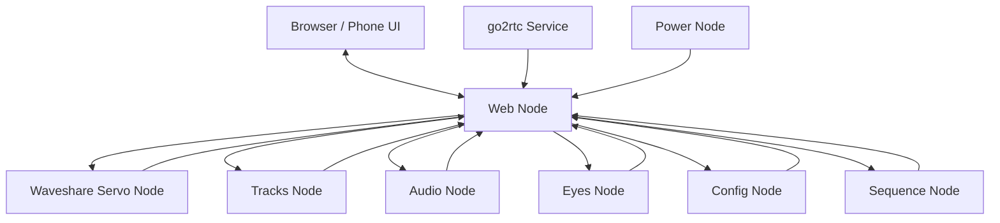

# Web Node

## Purpose

The web node is the user-facing front door of WALL-E-DORA. It serves the HTTPS
frontend, bridges browser events into Dora, fans status updates back out to the
UI, proxies the camera service, manages the on-device photo gallery, and runs
the lightweight face-follow logic that can steer the head toward detected
people.

## What It Currently Does

- Serves the React frontend over HTTPS on port `8443`
- Pushes live robot state to the browser over WebSocket
- Forwards UI and gamepad commands into Dora topics
- Exposes the current `Home / Showtime / Gallery` experience
- Shows per-servo control and diagnostics views
- Proxies the camera stream and recent snapshots from `go2rtc`
- Saves snapshots into the local gallery
- Offers optional face-follow mode for the head pivot servo
- Stores and serves gamepad profiles

## Architecture


```mermaid
graph TD
    Browser[Browser / Phone UI]
    WebNode[Web Node]
    Go2RTC[go2rtc Service]
    Servo[Waveshare Servo Node]
    Tracks[Tracks Node]
    Audio[Audio Node]
    Eyes[Eyes Node]
    Power[Power Node]
    Config[Config Node]
    Sequence[Sequence Node]

    Browser <--> WebNode
    Go2RTC --> WebNode

    Servo --> WebNode
    Tracks --> WebNode
    Audio --> WebNode
    Eyes --> WebNode
    Power --> WebNode
    Config --> WebNode
    Sequence --> WebNode

    WebNode --> Servo
    WebNode --> Tracks
    WebNode --> Audio
    WebNode --> Eyes
    WebNode --> Config
    WebNode --> Sequence
```

## Frontend Surface

The current UI is intentionally focused rather than dashboard-for-dashboard's
sake:

- `Home`: quick access to sounds and eye images
- `Showtime`: scenes, gestures, and action buttons
- `Gallery`: saved camera snapshots
- Servo pages: per-servo control, status, and diagnostics
- Optional camera background mode behind the UI
- Optional face-follow toggle from the status area

## Camera / Media Features

The web node does not own the USB camera directly anymore. Instead:

- `go2rtc` handles the raw USB camera stream
- the web node proxies that stream over the same HTTPS origin as the UI
- the UI can switch to a live camera background
- snapshots are captured and stored under `out/photos`
- face-follow reuses recent frames for lightweight server-side detection

Exposed HTTP endpoints include:

- `GET /camera/snapshot.jpg`
- `GET /camera/stream.mjpeg`
- `GET /api/photos`
- `POST /api/photos/capture`
- `GET /api/face-tracking`
- `POST /api/face-tracking`

## Dora Integration

### Inputs

| Input ID | Source | Description |
| --- | --- | --- |
| `tick` | `dora/timer/millis/33` | Regular UI / server update tick |
| `voltage` | `power/voltage` | Battery voltage |
| `current` | `power/current` | Battery current |
| `power` | `power/power` | Battery power draw |
| `soc` | `power/soc` | Battery state of charge |
| `runtime` | `power/runtime` | Estimated remaining runtime |
| `capacity` | `power/capacity` | Estimated battery capacity |
| `discharge_rate` | `power/discharge_rate` | Battery discharge rate |
| `shutdown` | `power/shutdown` | Low-battery shutdown signal |
| `available_sounds` | `audio/available_sounds` | Sound list for the UI |
| `servo_status` | `waveshare_servo/servo_status` | Live single-servo status |
| `servos_list` | `waveshare_servo/servos_list` | Current discovered servo list |
| `servo_diagnostics` | `waveshare_servo/servo_diagnostics` | On-demand diagnostics payload |
| `setting_updated` | `config/setting_updated` | Specific setting change notification |
| `settings` | `config/settings` | Full settings broadcast |
| `available_images` | `eyes/available_images` | Eye image list |
| `sequence_state` | `sequence/sequence_state` | Running / idle sequence state |

### Outputs

The web node publishes many UI-originated events. The most important groups are:

- audio control: `play_sound`, `set_volume`, `stop`
- eye control: `play_gif`, `list_images`
- sequence triggering: `sequence_trigger`
- track/gamepad control: `GAMEPAD_*`
- servo control: `move_servo`, `wiggle_servo`, `calibrate_servo`,
  `detach_servo`, `update_servo_setting`, `read_servo_diagnostics`,
  `clone_servo`, `factory_reset_servo`
- config updates: `update_setting`
- gamepad profile management: `save_gamepad_profile`, `get_gamepad_profile`,
  `check_gamepad_profile`, `delete_gamepad_profile`, `list_gamepad_profiles`

## Development Notes

### Frontend Build

```bash
make web/build
make web/build-watch
```

### Python / Node Work

```bash
pytest nodes/web/tests -q
python3 -m compileall nodes/web/web
```

### Runtime Assumptions

- TLS is self-signed for local robot use
- `go2rtc` is expected to be available as a separate service
- OpenCV / NumPy are optional but needed for face-follow mode

## Publishing / Support Notes

- Keep this README in sync when the web UI surface changes
- Use English in docs and Discussions
- Direct questions, build help, and showcase posts to GitHub Discussions
- The public support channel for now is Discussions, not Issues
